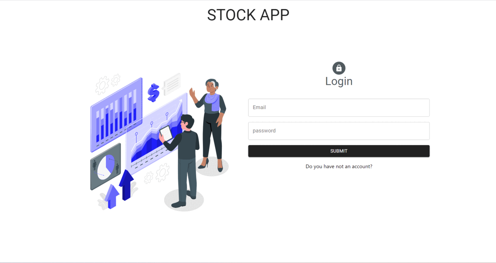

# Stock App Project

## `Installation`

```
yarn create react-app (folderName OR .)
```

## `Libraries Used`

- `@reduxjs/toolkit`
- `react-redux`
- `axios`
- `react-router-dom`
- `@mui/material-ui`
- `@mui/x-data-grid`
- `@emotion/react`
- `@emotion/styled`
- `react-router-dom`
- `react-toastify`
- `redux-persist`
- `formik`
- `yup`

## `What am I doing`

- I am making an inventory program that keeps product and company information. This program is software that helps manage the company's inventory.
- In this program, information such as stock amount, supplier information, sales price, purchase price are recorded for each product.
- Crud operations are performed according to the swagger and redoc documents from the backend.

## Project Skeleton

```

├── public
│     └── index.html
├── src
│    ├── app
│    │     └── store.jsx
│    ├── assets
│    │     ├── loading.gif
│    │     └── result.svg.gif
│    ├── components
│    │     ├── modals
│    |     │     ├── BrandModal.jsx
│    |     │     ├── FirmModal.jsx
│    |     │     ├── ProductModal.jsx
│    |     │     ├── PurchaseModal.jsx
│    |     │     └── SaleModal.jsx
│    |     ├── BrandCard.jsx
│    |     ├── Charts.jsx
│    |     ├── FirmCard.jsx
│    |     ├── KpiCard.jsx
│    |     ├── LoginForm.jsx
│    |     ├── MenuListItems.jsx
│    │     └── RegisterForm.jsx
│    ├── features
│    |     ├── authSlice.jsx
│    │     └── stockSlice.jsx
│    ├── helper
│    │     └── ToastNotify.js
│    ├── hooks
│    |     ├── useAuth.jsx
│    |     ├── useAxios.jsx
│    │     └── useStockCall.jsx
│    ├── pages
│    │     ├── Brand.jsx
│    │     ├── Dashboard.jsx
│    │     ├── Firms.jsx
│    │     ├── Home.jsx
│    │     ├── Login.jsx
│    │     ├── Products.jsx
│    │     ├── Purchases.jsx
│    │     ├── Register.jsx
│    │     └── Sales.jsx
│    ├── router
│    │     ├── AppRouter.jsx
│    │     └── PrivateRouter.jsx
│    ├── styles
│    │     └── globalStyle.jsx
│    ├── App.js
│    ├── index.js
│    └── index.css
├── package.json
├── .gitignore
└── yarn.lock
```

## `Tools Used`

- `Redux Dev Tools` : It is a browser extension that runs on Chrome and enables tracking of all changes made to the global state. For download [click here.](https://chrome.google.com/webstore/detail/redux-devtools/lmhkpmbekcpmknklioeibfkpmmfibljd?utm_source=chrome-ntp-icon)`

## `Gif`


